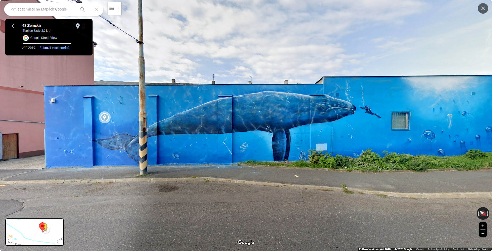
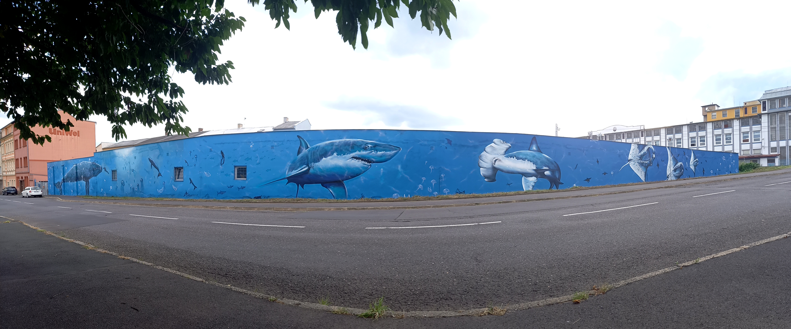

### Zpracování dlouhého graffiti do jedné fotografie
[English](data/README[en].md)

Tento příspěvek je věnovaný mému kamarádovi [**Kamilu Vackovi (Camo)**](https://www.vacekdesign.com) a jeho talentu dělat veřejný prostor příjemnějším místem.

Graffiti je namalováno na zdi v [**Zemské ulici v Teplicích**](https://www.google.com/maps/@50.6577723,13.8362357,3a,75y,233.75h,82.15t/data=!3m7!1e1!3m5!1sESP8tkQMhFuP7C-8dOMblg!2e0!6shttps:%2F%2Fstreetviewpixels-pa.googleapis.com%2Fv1%2Fthumbnail%3Fpanoid%3DESP8tkQMhFuP7C-8dOMblg%26cb_client%3Dmaps_sv.tactile.gps%26w%3D203%26h%3D100%26yaw%3D51.351086%26pitch%3D0%26thumbfov%3D100!7i16384!8i8192?hl=cs-CZ&coh=205409&entry=ttu).

Cílem tohoto počinu bylo získat namísto klasické panoramatické fotografie jeden dlouhý snímek, který by nebyl deformovaný.

Snímek vznikal tak, že co 5 kroků byla pořízena [**fotografie**](data/working folder) , které následně byly pospojovány ve Photoshopu.

Inspirace do budoucna:  
Pro příště by to chtělo zajistit, aby fotky byly foceny všechny ze stejného úhlu, protože nejvíce práce bylo právě s tím, že každý snímek je lehce hnut jiným směrem, což jejich spojení značně zpomalilo.
Ideální by byl nějaký stojan s kolečkem (nebo s kolečky), který by zajistil, že všechny fotky budou foceny ze stejné vzdálenosti, výšky a úhlu.

[**Seskládaný obrázek v plném rozlišení**](data/Camo-Whale.jpg)  
  

[**Panoramatický obrázek místa**](data/20240724_180207.jpg)

